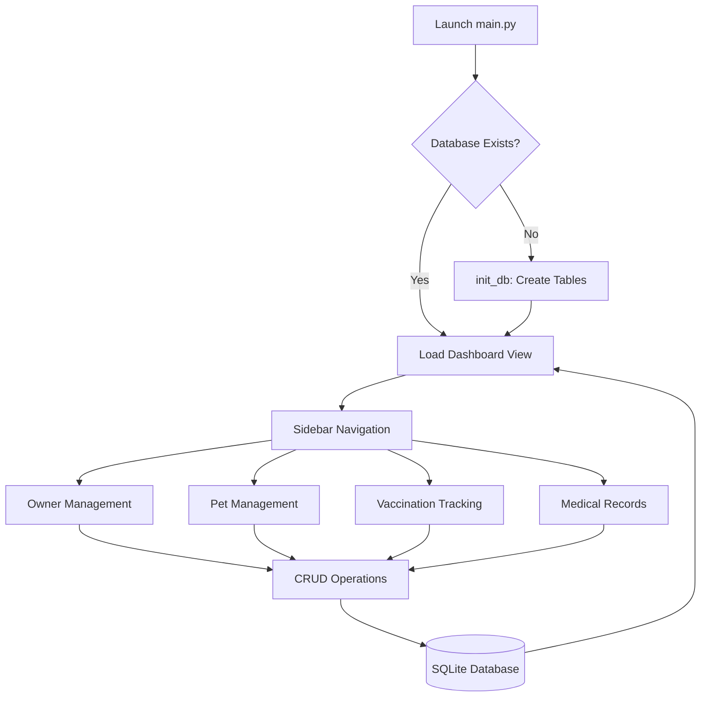

# AlagangHayop – Pet Health & Records Management System

> [!IMPORTANT]
> **Status:** Still Under Production / Development. 

AlagangHayop is a desktop-based information system designed to help pet owners and veterinary clinics manage pet records digitally. It replaces traditional paper-based tracking with a robust, searchable, and organized digital database.

## 🛠 Tech Stack

- **Lanuage:** Python 3.12+
- **GUI Framework:** Tkinter (Standard Library)
- **Database:** SQLite3 (Serverless, File-based)
- **Typing:** Python `typing` module for static analysis and IDE stability.

## ⚙️ How the System Works

The system follows a modular architecture where the GUI layer interacts with a centralized database controller.

1.  **Launch:** On startup, `main.py` initializes the database (`alaganghayop.db`) and builds the primary dashboard.
2.  **Navigation:** A persistent sidebar allows users to switch between management modules (Owners, Pets, Vaccinations, Medical Records).
3.  **Data Management (CRUD):**
    -   **Owners:** Register owners with name, contact, and address. Includes fuzzy-matching to prevent duplicate names (e.g., "John Doe" vs "John D. Doe").
    -   **Pets:** Link pets to specific owners. Supports species and breed tracking.
    -   **Health Records:** Track vaccinations and medical treatments, linked directly to pet profiles.
4.  **Real-time Stats:** The dashboard calculates and displays data summaries (total counts) dynamically.

## 📊 System Flowchart

## 📁 Project Structure

- `main.py`: Entry point and main window manager.
- `database.py`: Handles all SQLite connections and CRUD logic.
- `styles.py`: Centralized UI theme (colors, fonts, padding).
- `views/`: Contains individual UI frames for each module.
    - `owner_view.py`: Owner management interface.
    - `pet_view.py`: Pet profile management.
    - `vaccination_view.py`: Vaccination tracking.
    - `medical_view.py`: Diagnosis and treatment logging.

---
*Developed for modern pet care management.*

